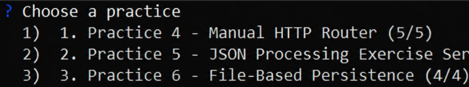

\# Звіт з лабораторної роботи №6

&#x20;

\## Виконанi вправи

\* \*\*`1.js` (Читання / GET)\*\* Сервер зчитує весь масив об'єктів із файлу `data.json` та відправляє його клієнту у форматі JSON.

\* \*\*`2.js` (Створення / POST)\*\* Сервер приймає нові дані в тілі запиту, перетворює їх і повністю перезаписує файл з новими параметрами.

\* \*\*`3.js` (Оновлення / PUT)\*\* Скрипт отримує ID з URL-адреси, знаходить відповідний об'єкт у масиві, замінює його властивості на нові та зберігає оновлений масив назад у файл.

\* \*\*`4.js` (Видалення / DELETE)\*\* Пошук об'єкта за його ідентифікатором та видалення його зі списку. Якщо об'єкт не знайдено, сервер повертає помилку 404.


\### Інструкція із запуску

Для перевірки роботи серверів необхідно відкрити термінал у папці з проєктом та запустити потрібний файл через середовище Node.js, вказавши порт (наприклад, 3000):


```bash

node 1.js 3000
```
### Результат роботи

**
